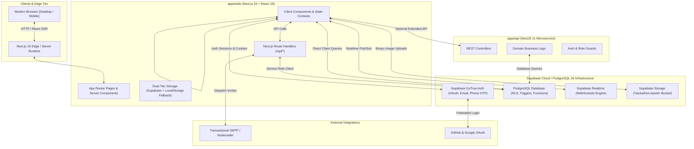
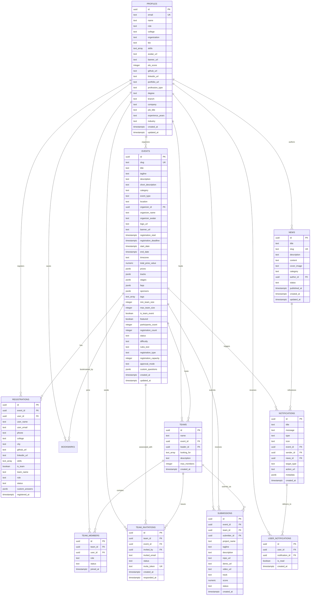

# Hacker's Unity — System Architecture & Technical Specifications

> **Document Version:** 2.4.0  
> **Target Release:** Production 2026  
> **Repository:** `hackers-unity`  
> **Status:** Active / Monorepo Architecture  

---

## 1. Monorepo Architecture & Workspace Layout

The platform is engineered as a high-performance **Turborepo** monorepo managed via **pnpm workspaces** (`pnpm@9.15.0`). It decouples client-facing applications, backend microservices, and shared data contracts into modular packages.

```
hackers-unity/
├── apps/
│   ├── web/                     # Next.js 16.3.1 (React 19, TailwindCSS v4, App Router)
│   │   ├── app/                 # App Router pages, layouts, and route handlers
│   │   │   ├── admin/           # Platform administration & notification broadcaster
│   │   │   ├── api/             # Next.js Server Route Handlers (events, invite-email, registrations)
│   │   │   ├── auth/            # Auth callback & verification routes
│   │   │   ├── dashboard/       # User dashboard, organizing portal & registration manager
│   │   │   ├── events/          # Universal events & workshops directory
│   │   │   ├── hackathons/      # Hackathon details, squad invite & registration flow
│   │   │   ├── host/            # 7-step Hackathon creation wizard & edit mode
│   │   │   ├── leaderboard/     # Global Elo & University rankings
│   │   │   ├── news/            # Platform news magazine & editorial system
│   │   │   ├── settings/        # Hacker profile, education, professional & security settings
│   │   │   ├── teammates/       # Builder matchmaking arena & squad formation
│   │   │   └── page.tsx         # High-conversion landing page
│   │   ├── components/          # Reusable UI component library (modals, cards, editors)
│   │   ├── lib/                 # Core services, auth context, storage engine, hooks
│   │   ├── supabase/            # PostgreSQL database schemas & incremental migrations (v1 - v3)
│   │   └── utils/               # Supabase SSR client, server, and middleware utilities
│   │
│   └── api/                     # NestJS 11.0.1 Backend Microservice (TypeScript, Express)
│       ├── src/                 # Controllers, Modules, Services, and Guards
│       └── test/                # Unit & E2E Jest test suites
│
├── packages/
│   └── shared-types/            # Canonical TypeScript interfaces, enums, and DTOs
│       └── src/
│           ├── auth.ts          # Auth tokens, user roles, login/register DTOs
│           ├── user.ts          # UserPublic, OrganizerProfile, profession metadata
│           ├── event.ts         # EventPublic, EventStage, EventFaq, Prize, DTOs
│           ├── registration.ts  # Registration, custom answers, status enums
│           ├── team.ts          # Team, TeamMember, squad statuses & invite DTOs
│           ├── notification.ts  # Notifications, UserNotifications, NewsArticle, DTOs
│           └── index.ts         # Central exports and common ApiResponse<T>
│
├── docker-compose.yml           # Local dev infrastructure (Postgres 16, Redis 7, Meilisearch 1.12)
├── pnpm-workspace.yaml          # Monorepo package workspace definitions
├── turbo.json                   # Build pipeline task caching & execution graph
└── package.json                 # Monorepo scripts & dependencies
```

---

## 2. High-Level System Architecture



---

## 3. Database Schema & Entity Relationship Model

The database is built on **PostgreSQL 16** within Supabase, featuring strict relational integrity, UUID primary keys (`uuid-ossp` / `gen_random_uuid()`), JSONB flexibility for dynamic content, performance indexes, and database-level triggers.



---

## 4. Key Database Functions & Automated Triggers

### 4.1. Real-Time Registration Counter (`update_registration_count`)
Maintains an atomic counter of registered hackers per event without slow runtime `COUNT(*)` aggregations:
```sql
CREATE OR REPLACE FUNCTION public.update_registration_count()
RETURNS TRIGGER AS $$
BEGIN
  IF TG_OP = 'INSERT' THEN
    UPDATE public.events
    SET registration_count = registration_count + 1,
        updated_at = NOW()
    WHERE id = NEW.event_id;
    RETURN NEW;
  ELSIF TG_OP = 'DELETE' THEN
    UPDATE public.events
    SET registration_count = GREATEST(registration_count - 1, 0),
        updated_at = NOW()
    WHERE id = OLD.event_id;
    RETURN OLD;
  END IF;
  RETURN NULL;
END;
$$ LANGUAGE plpgsql SECURITY DEFINER;
```

### 4.2. Auto-Slug Generation Engine (`generate_unique_slug`)
Automatically creates URL-friendly slugs for hackathons and news articles while collision-checking and auto-incrementing:
```sql
CREATE OR REPLACE FUNCTION public.generate_unique_slug(base_title TEXT)
RETURNS TEXT AS $$
DECLARE
  base_slug TEXT;
  final_slug TEXT;
  counter INTEGER := 0;
BEGIN
  base_slug := LOWER(TRIM(base_title));
  base_slug := REGEXP_REPLACE(base_slug, '[^a-z0-9]+', '-', 'g');
  base_slug := REGEXP_REPLACE(base_slug, '^-+|-+$', '', 'g');
  IF base_slug = '' OR base_slug IS NULL THEN base_slug := 'event'; END IF;
  final_slug := base_slug;
  WHILE EXISTS (SELECT 1 FROM public.events WHERE slug = final_slug) LOOP
    counter := counter + 1;
    final_slug := base_slug || '-' || counter;
  END LOOP;
  RETURN final_slug;
END;
$$ LANGUAGE plpgsql;
```

---

## 5. Authentication & Session Architecture

Authentication is powered by **Supabase Auth (GoTrue)** integrated with Next.js SSR via `@supabase/ssr`:

1. **Client-Side Auth Context (`apps/web/lib/auth-context.tsx`):**
   - Maintains `user: UserPublic | null`, `supabaseUser: SupabaseUser | null`, `session: Session | null`, and `loading: boolean`.
   - Listens to `supabase.auth.onAuthStateChange` to reactively update session tokens.
   - Synchronizes user metadata into the `profiles` table upon sign-up or profile update.
2. **SSR Middleware (`apps/web/middleware.ts` & `utils/supabase/middleware.ts`):**
   - Refreshes auth cookies on every inbound HTTP request via `createServerClient`.
   - Manages token lifecycles safely across Edge and Server Components.
3. **Multi-Factor / Multi-Method Providers:**
   - Email/Password with verification confirmation flow.
   - Passwordless Phone SMS OTP via `signInWithPhone` & `verifyPhoneOtp`.
   - OAuth redirect handling via `/auth/callback` code exchange.

---

## 6. Real-Time WebSocket Infrastructure

To support high-velocity hackathons, Hacker's Unity utilizes **Supabase Realtime WebSockets**:
- **Events Channel (`public.events`):**
  - Table is published to `supabase_realtime`.
  - When an organizer launches a hackathon in `/host`, clients listening to `subscribeToPublishedEvents` receive the `INSERT` or `UPDATE` payload instantly, updating directory feeds without a manual refresh.
- **Notification Toast Engine (`public.user_notifications`):**
  - Realtime publication enables instant delivery of `user_notifications`.
  - When an admin sends a broadcast or a team leader invites a user, a new record in `user_notifications` immediately activates `<NotificationToast />` and increments the bell badge in `<Navbar />`.

---

## 7. Next.js Server Route Handlers

### 7.1. `/api/events` (POST)
- Handles server-side hackathon persistence using `createClient` with administrative privileges.
- Validates dates, generates slugs, maps JSON fields, and broadcasts changes.

### 7.2. `/api/invite-email` (POST)
- Dispatches responsive HTML team invitations via Nodemailer.
- Generates deep links (`/hackathons/[slug]/invite?token=[token]`).
- Includes fallback direct console preview when SMTP credentials are not yet configured in `.env`.

### 7.3. `/api/registrations` (POST)
- Manages solo and team event registrations.
- Resolves event slugs to UUIDs.
- Auto-creates or updates hacker profiles in `public.profiles` if missing.
- Prevents duplicate registrations via unique database constraints.

---

## 8. Dual-Tier Storage & Offline Resilience

To guarantee 100% development uptime and prevent interface breakage during database configuration, the platform implements a dual-tier persistence pattern:
1. **Tier 1 (Cloud):** Supabase PostgreSQL via `supabase-service.ts` and `@supabase/supabase-js`.
2. **Tier 2 (Client Cache & Fallback):** `lib/storage.ts` provides structured `localStorage` persistence and cross-tab event synchronization via `window.dispatchEvent(new Event('hackers_unity_storage_change'))`.
3. **Seed Data:** `lib/mock-data.ts` contains battle-tested mock events (`CodeWars`, `Clash Of Coders`, `ChatGPT Codex`, etc.), leaderboard champions, and mock news articles.

---

## 9. Storage & Asset Pipeline

- **Supabase Storage Bucket:** `hackathon-assets` (configured with public read access).
- **Client-Side Image Manipulation:**
  - `AvatarUpload` (`components/avatar-upload.tsx`) and `BannerUpload` (`components/banner-upload.tsx`) use `react-easy-crop` to provide interactive panning, zooming, and aspect ratio locking (1:1 for avatars, 16:9 or 3:1 for banners).
  - Canvas utilities (`lib/crop-utils.ts`) crop the image in the browser and output clean JPEG/WebP blobs.
  - Uploaded directly to `storage.from('hackathon-assets').upload(...)` with timestamped sanitized filenames.
